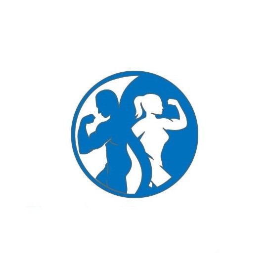

# Amy Buckley Fitness
by Donal O'Farrell

Milestone Project 1: User-Centric Frontend Development - Code Institute 

The planning for this project including all wireframes can be found here: 

https://docs.google.com/document/d/1IStCi0tCLSHwtD9C5PukdXQtL47PG-FKGtzEI14P-W0/edit#heading=h.40tljqgwa982

## UX
My design goal with the site was to keep things simple and go with a mobile-first approach. The color scheme was chosen to be effiecent, easy to take in quickly and the white and blue associated with fitness along with some shades of orange to compliment them.

For clients, I wanted them to have quick access to the class timetable and they can access that with just one click from the landing page and with the links being very visible.

For potential new PT clients, I have have made the Personal training section of equal importance on the NavBar and again just one click away. 

## Technologies
1. HTML
2. CSS
3. Bootstrap (4.3)

## Features
On the landing page (index.html) you can see the logo and trainer's name, have access to the navbar, segment on what the trainer provides including a direct link to the timetable, a picture of the trainer and access to the footer which contains a small about section, email of the trainer and links to social media.

On classes.html you can see the logo and trainer's name, have access to the navbar, the location of all classes with a direct link to google maps, info on classes, the timetables for each day and access to the footer which contains a small about section, email of the trainer and links to social media.

On personneltraining.html you can see the logo and trainer's name, have access to the navbar, a photo of personnel training and a segment on what the personnel training involves including a direct link to the contact page, and access to the footer which contains a small about section, email of the trainer and links to social media.

On contact.html you can see the logo and trainer's name, have access to the navbar, contact form with text asking what people may want to ask about and access to the footer which contains a small about section, email of the trainer and links to social media.

### Features Left to Implement
I would like to add testimonials from previous clients to the Personal Training page. More photos would help flesh out group classes information.

## User Stories

###### Story 1

Scenario: An existing client wants to get the latest class times.

Requirements:
Ability to access a class timetable.

###### Story 2

Scenario: A potential client wants to check what classes are available currently.

Requirements:
Ability to access a class timetable.

###### Story 3

Scenario: A potential client wants to hire a new PT.

Requirements:
Information regarding personal training.
Contact information.

###### Story 4

Scenario: Potential client with a special circumstances e.g. pregnant, injury, disability.

Requirements:
Contact information.

## Testing
The potential clients in the user stories can access their required information.

The contact section has the 'required' tags for the name, email and message section so these can't be left blank. The email section also needs to recognize a valid email address before you can submit.

The site performs as its meant to across Chrome, Safari, Firefox and Edge browsers.

The navbar connects all pages smoothly and was tested accross full device range.

The social media links connects to all relevant pages and was tested accross full device range.

### Bugs

No bugs as of current build.

Social media links were not working and a typo was discovered.

Bootstrap not loading probably so moved to bottom of HTML as best practice.

## Deployment
This site is hosted using GitHub pages, deployed directly from the master branch. The deployed site will update automatically upon new commits to the master branch. In order for the site to deploy correctly on GitHub pages, the landing page must be named `index.html`.

To run locally, you can clone this repository directly into the editor of your choice by pasting `git clone https://github.com/dof-bull/ci_milestone_project_1_Amy_Buckley_Fitness.git` into your terminal. To cut ties with this GitHub repository, type `git remote rm origin` into the terminal.

## Credits

Ginifab for their excellent color picker app so I could get the HEX from the logo.
(https://www.ginifab.com/feeds/pms/color_picker_from_image.php).

Coolors.co for use of their color pallete generator.
(https://coolors.co/0071bd-fffffc-2a2b2a-a8763e).

Google Fonts for use of the Abel font.
(https://fonts.google.com/specimen/Abel)

### Content
All text content in this site were written by me on behalf of Amy Buckley Fitness. 

### Media
All photos are used with permission of Amy Buckley Fitness.

### Acknowledgements
All code used in this project was written by me, either in previous tutorials, during the course or during the project itself.

**This project is currently for education purposes only and not for commercial purposes**